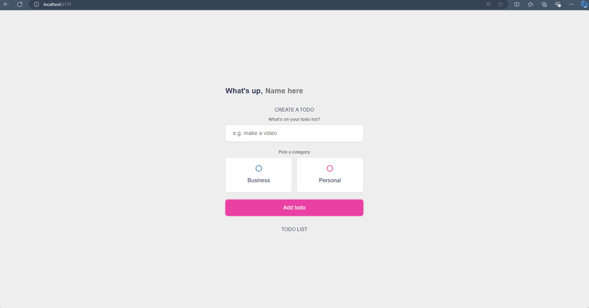

# Simple Vue 3 Todo List Project



This is a simple Todo List project built with Vue 3 and Vite. The goal of this project is to provide a basic application for adding and removing tasks with categories, where the data is persisted using the browser's `localStorage`.

## Project Structure

```bash
vue-simple-project/
├── .vscode/
├── node_modules/
├── public/
│   └── Simple vue todo list.gif
├── src/
│   ├── App.vue
│   ├── main.css
│   ├── main.js
│   ├── style.css
├── .gitignore
├── index.html
├── package-lock.json
├── package.json
├── README.md
├── vite.config.js
```